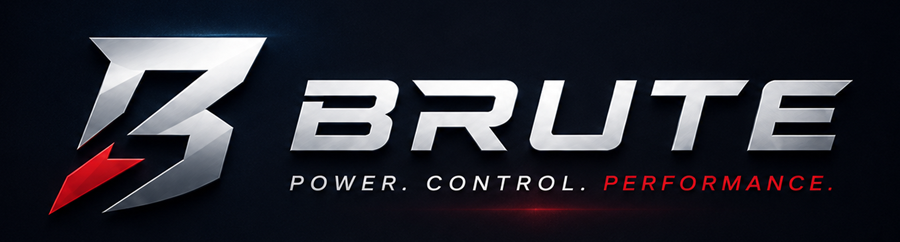
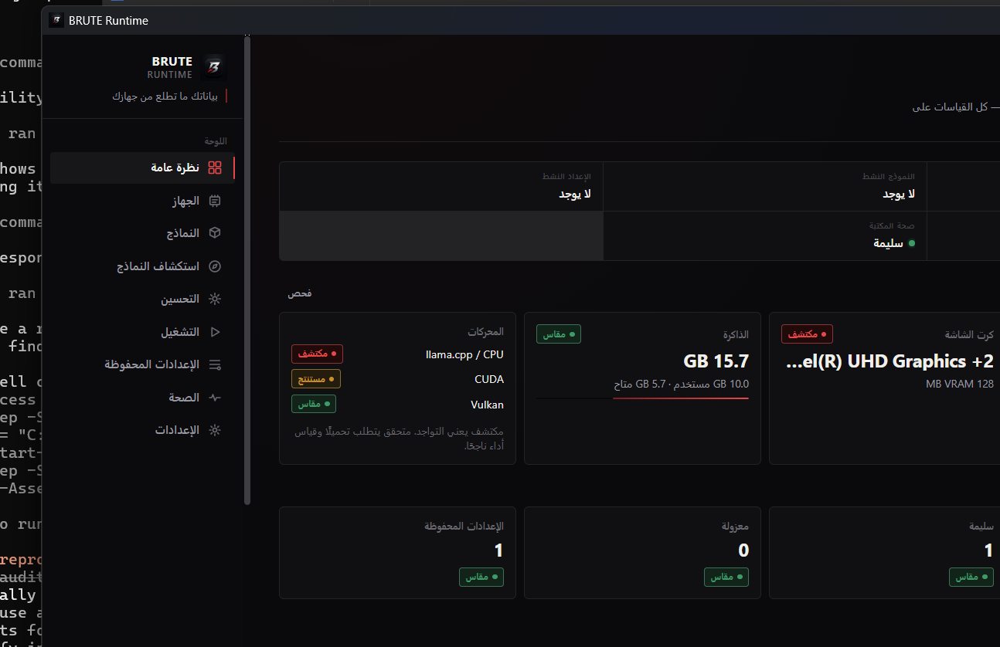
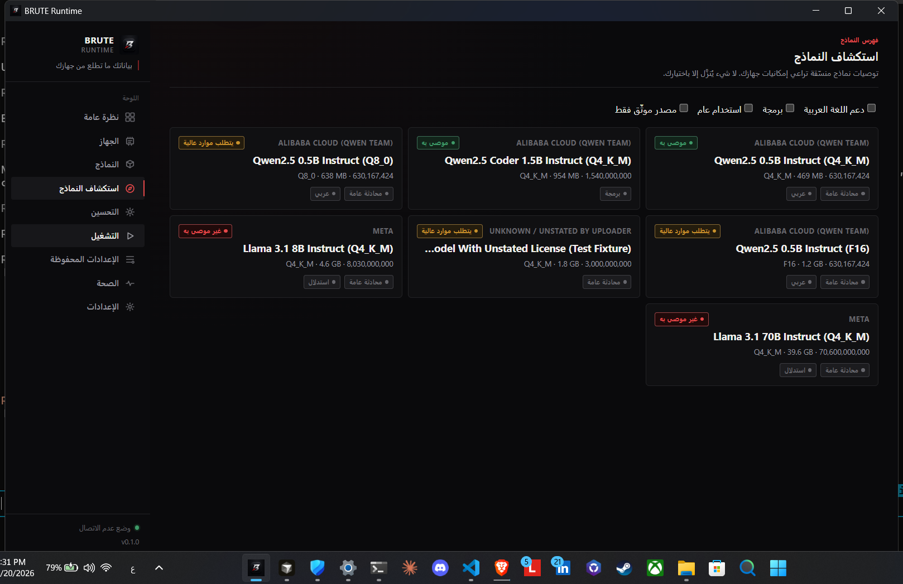
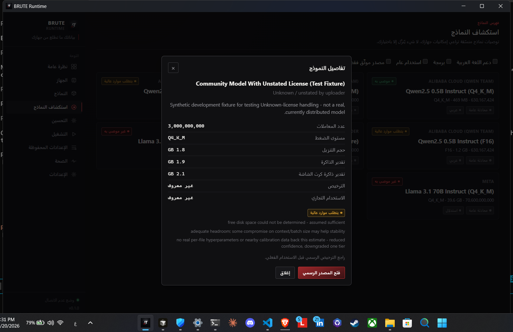

<p align="center">
  
</p>

<p align="center"><strong>POWER. CONTROL. PERFORMANCE.</strong></p>

<p align="center">
  By Engineer Abdullah Alamri &nbsp;·&nbsp; بواسطة المهندس عبدالله العمري
</p>

<p align="center">
  <strong>بياناتك ما تطلع من جهازك.</strong><br>
  <strong>Your data never leaves your device.</strong>
</p>

<p align="center">
  <a href="https://github.com/OWNER/brute-runtime/actions/workflows/ci.yml"></a>
  <a href="LICENSE-NOTICE.md"></a>
  
</p>

> Replace `OWNER` in the badge URL above with the actual GitHub
> organization/user once this repository is pushed.

---

## What is BRUTE Runtime?

BRUTE Runtime is a Windows desktop app that runs open local AI models
(GGUF format) **entirely on your own computer** — no cloud, no account,
no subscription. Point it at a model, or let it recommend one that
actually fits your hardware, and it handles the rest: verifying your
GPU/CPU backend actually works, tuning the runtime configuration for
your specific machine, and running the model locally with live output.

You do not need to understand GPUs, quantization, or command-line tools
to use it. If you're comfortable installing any other Windows
application, you're comfortable installing BRUTE.

It's also available as a scriptable command-line engine (`brute`) for
anyone who wants to automate the same inspection/benchmarking/tuning
pipeline the desktop app is built on — see [`docs/cli-reference.md`](docs/cli-reference.md).

## Main capabilities

- **Hardware-aware model recommendations** — BRUTE inspects your real
  CPU, RAM, and GPU, then ranks a curated model catalog by what will
  actually run well on *your* machine, with an honest explanation for
  every recommendation (never a fabricated universal score).
- **Automatic GGUF discovery** — scans a fixed, safe set of common
  folders (Downloads, Documents, `C:\Models`, LM Studio's and Ollama's
  model caches) for GGUF files you already have, plus a manual
  "add folder" option. Never scans your whole disk, never runs in the
  background.
- **Automatic tuning** — benchmarks a small, bounded set of runtime
  configurations (thread count, GPU offload, context/batch size) safely
  and picks the most stable, best-performing one for your hardware —
  never a brute-force search, never a single noisy sample.
- **Bundled local runtime** — a CPU llama.cpp runtime ships inside the
  installer, so a typical user never has to find, download, or configure
  an inference backend themselves.
- **Arabic and English interface** — full RTL/LTR layout switching, not
  a partial translation.
- **Privacy-first, offline by default** — see [Privacy](#privacy) below.

## Screenshots

| Overview | Discover Models | Model details |
|---|---|---|
|  |  |  |

Screenshots above are real captures from the installed Windows build
(Arabic UI shown; English is fully supported via Settings).

## Download (Windows)

Windows builds are packaged and manually verified on real hardware.
Get the latest installer from the
[**GitHub Releases**](../../releases) page:

- `BRUTE-Runtime-v0.1.0-Windows-x64-Setup.exe` — the installer.
- `SHA256SUMS.txt` — checksums to verify the download.

### Installation steps

1. Download `BRUTE-Runtime-v0.1.0-Windows-x64-Setup.exe` from the
   Releases page above.
2. Double-click it. Windows SmartScreen will likely show an
   **"Unknown Publisher"** warning — this beta is not yet
   code-signed with a commercial certificate (see
   [Known limitations](#known-limitations)). This does not mean the
   file is unsafe; it means Windows can't yet verify a publisher
   identity for it.
3. *(Optional but recommended)* Verify the download's integrity before
   running it:
   ```powershell
   Get-FileHash BRUTE-Runtime-v0.1.0-Windows-x64-Setup.exe -Algorithm SHA256
   ```
   Compare the result against `SHA256SUMS.txt`.
4. Follow the installer prompts. No account, no internet connection
   required to install or run.

### Quick start

1. Launch BRUTE Runtime.
2. On first run, choose **"Scan device"** to look for GGUF models you
   already have, or **"Discover Models"** to browse hardware-matched
   recommendations.
3. If you pick a recommended model, BRUTE shows its official source
   page (opened in your default browser, never inside the app) so you
   can download it yourself — BRUTE never downloads a model without
   you explicitly choosing to.
4. Import the model, let BRUTE auto-tune it once, then use the **Run**
   page to generate text locally.

## Supported platforms

| Platform | Status |
|---|---|
| Windows 10/11 x64 | **Packaged and manually verified** — installer built, installed, and exercised end-to-end on real hardware. |
| macOS | **Compile-verified only.** The core engine builds cleanly for `x86_64-apple-darwin`/`aarch64-apple-darwin`, but no macOS machine has run it. Not release-ready. |
| Linux | **Compile-verified only.** The core engine builds cleanly for `x86_64-unknown-linux-gnu`, but no Linux machine has run it. Not release-ready. |

See [`docs/cross-platform.md`](docs/cross-platform.md) for exactly what
"compile-verified" does and does not prove.

## Known limitations

This section is intentionally honest, not a marketing gloss — full
detail lives in [`docs/known-limitations.md`](docs/known-limitations.md).
Headline items:

- **This beta is unsigned.** Windows SmartScreen will warn on first run.
  See [Security](#security).
- **Not every model runs well on every device.** BRUTE estimates fit
  from your real hardware and a model's real requirements, and is
  upfront when a model is "Heavy" or "Not recommended" for your
  machine — it does not claim universal compatibility.
- **macOS and Linux are not release-ready** (see table above).
- **No pause/resume on model downloads** — a cancelled download restarts
  from zero.
- Additional real, specific gaps (each one found and either fixed or
  documented during real verification) are catalogued in
  [`docs/known-limitations.md`](docs/known-limitations.md).

## Privacy

**بياناتك ما تطلع من جهازك — your data never leaves your device.**

- No accounts, no telemetry, no analytics, no crash reporting, no
  remote logging, no background network activity.
- The **only** network activity BRUTE ever performs is one you
  explicitly trigger: downloading a model you chose, or opening a
  model's official source page in your system browser.
- Full detail, including exactly which local files BRUTE writes and
  what a sanitized export redacts: [`PRIVACY.md`](PRIVACY.md) and the
  deeper [`docs/privacy-model.md`](docs/privacy-model.md).

We don't claim BRUTE is "100% secure" or "completely private" — no
software honestly can. What we do claim is narrow and verifiable: no
code path in this repository sends your data anywhere unless you
explicitly ask it to, and that claim is backed by an auditable source
tree and an explicit process/network audit (see
[`SECURITY.md`](SECURITY.md)).

## Security

Found a vulnerability? Please report it privately — see
[`SECURITY.md`](SECURITY.md) for how, and what's in scope.

## Development / building from source

```powershell
# Desktop app (Windows)
cd desktop
npm install
npm run tauri dev      # development
npm run tauri build    # production installer

# Core engine / CLI only
cargo build --release
cargo test
```

Full instructions, prerequisites, and verification checklists:
[`BUILDING.md`](BUILDING.md). Release packaging process:
[`RELEASE.md`](RELEASE.md).

## Contributing

BRUTE Runtime is not yet open for external code contributions while the
source-license decision (below) is pending — bug reports and
discussion are welcome. See [`CONTRIBUTING.md`](CONTRIBUTING.md) and
[`CODE_OF_CONDUCT.md`](CODE_OF_CONDUCT.md).

## License status

**This repository does not currently have a confirmed open-source
license.** The source code is publicly visible for transparency and
review, but visibility does not grant reuse, redistribution, or
commercial rights. See [`LICENSE-NOTICE.md`](LICENSE-NOTICE.md) for the
exact terms in effect until a permanent license is chosen.

> **TODO (owner action required):** select and add a permanent license
> before promoting this project as open source.

## Trademarks

"BRUTE", "BRUTE Runtime", and the BRUTE logo/visual identity are
protected — see [`TRADEMARKS.md`](TRADEMARKS.md).

## Full documentation index

- [`docs/architecture.md`](docs/architecture.md) — module layout, data flow, design rationale
- [`docs/cli-reference.md`](docs/cli-reference.md) — full command-line reference
- [`docs/security-model.md`](docs/security-model.md) — threat model, binary verification, supply-chain trust
- [`docs/privacy-model.md`](docs/privacy-model.md) — the mandatory no-telemetry/no-cloud list, identity handling
- [`docs/cross-platform.md`](docs/cross-platform.md) — what "compile-verified" does and does not prove
- [`docs/known-limitations.md`](docs/known-limitations.md) — real gaps, not hedging
- [`docs/windows-packaging.md`](docs/windows-packaging.md) — installer build, checksums, unsigned-build notice
- [`docs/measurement-methodology.md`](docs/measurement-methodology.md) — exactly how every reported number is obtained
- [`docs/model-catalog-schema.md`](docs/model-catalog-schema.md), [`docs/model-fit-classification.md`](docs/model-fit-classification.md), [`docs/recommendation-methodology.md`](docs/recommendation-methodology.md), [`docs/calibration-methodology.md`](docs/calibration-methodology.md) — how model recommendations are computed and explained
- [`docs/backend-verification.md`](docs/backend-verification.md), [`docs/tuning-search-space.md`](docs/tuning-search-space.md), [`docs/stability-classification.md`](docs/stability-classification.md), [`docs/tuning-ranking-methodology.md`](docs/tuning-ranking-methodology.md) — how backend verification and auto-tuning work
- [`docs/local-library-schema.md`](docs/local-library-schema.md), [`docs/model-identity.md`](docs/model-identity.md), [`docs/trust-and-provenance.md`](docs/trust-and-provenance.md), [`docs/duplicate-detection.md`](docs/duplicate-detection.md), [`docs/library-security.md`](docs/library-security.md), [`docs/library-privacy.md`](docs/library-privacy.md) — the trusted local model library
- Stage-by-stage verification logs (what was actually run and observed, including real bugs found and fixed live): [`docs/stage-0-verification.md`](docs/stage-0-verification.md) · [`docs/stage-1-verification.md`](docs/stage-1-verification.md) · [`docs/stage-2-verification.md`](docs/stage-2-verification.md) · [`docs/stage-3-verification.md`](docs/stage-3-verification.md) · [`docs/stage-4-verification.md`](docs/stage-4-verification.md)
